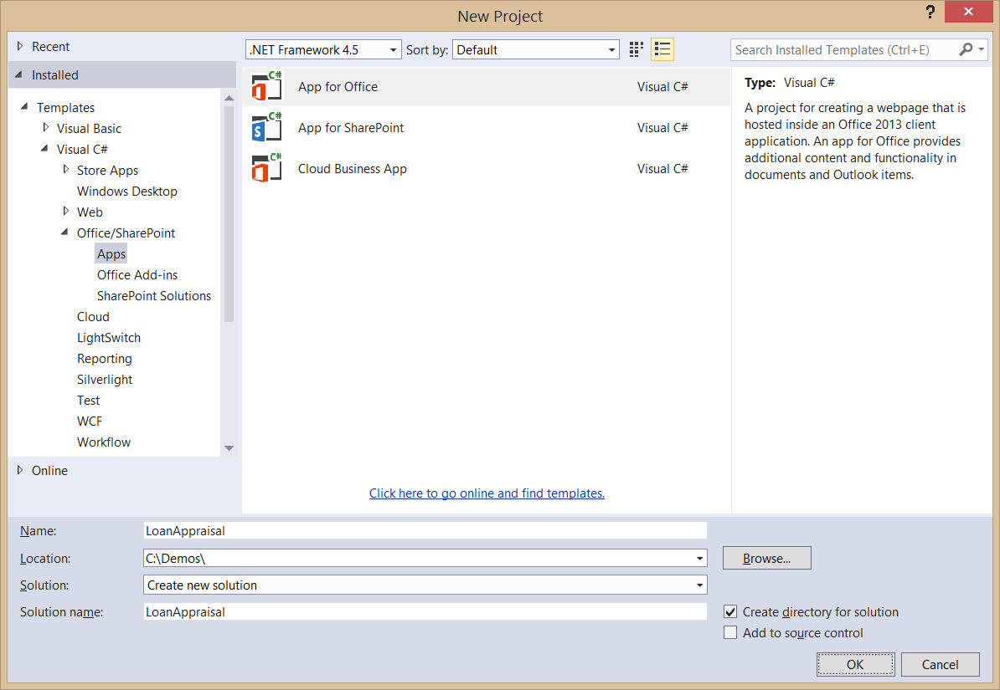
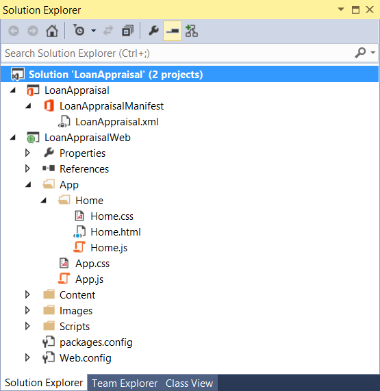
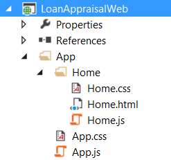
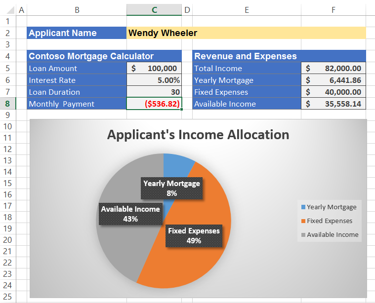
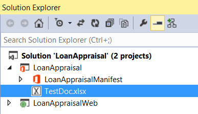
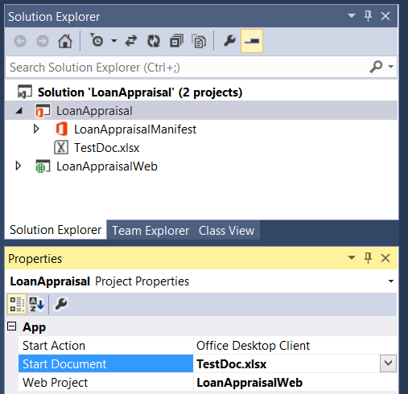
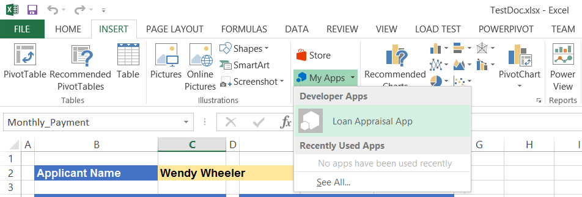
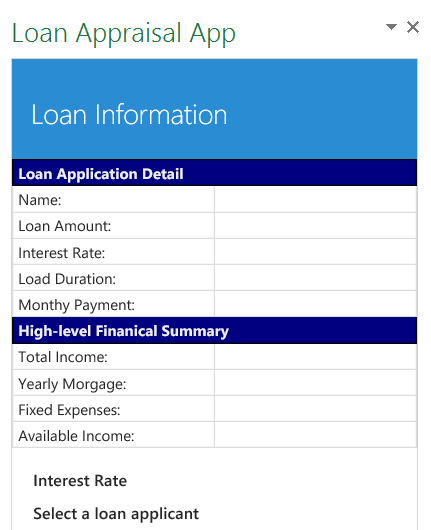
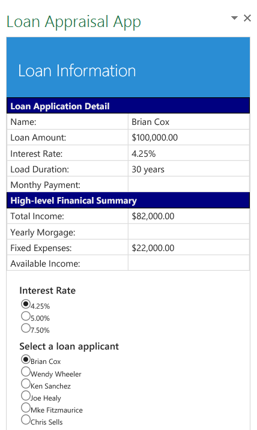
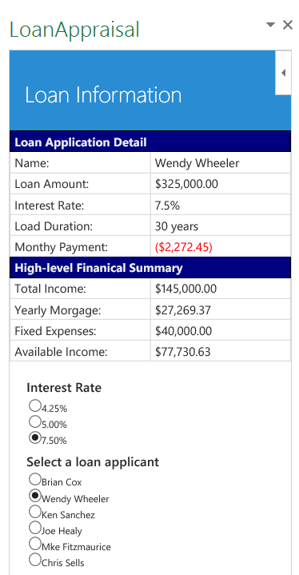

# Deep Dive into Office Excel Add-ins
In this lab you will get hands-on experience developing an Office Excel Add-in creates bindings between the app and a spreadsheet.

> **Note**: The name "apps for Office" is changing to "Office Add-ins". During the transition, the documentation and the UI of some Office host applications and Visual Studio tools might still use the term "apps for Office". For details, see [New name for apps for Office and SharePoint](https://msdn.microsoft.com/en-us/library/office/fp161507.aspx#bk_newname).

**Prerequisites:** 

1. You must have an Office 365 tenant and Microsoft Azure subscription to complete this lab. If you do not have one, the lab for **O3651-7 Setting up your Developer environment in Office 365** shows you how to obtain a trial. You must also have access to an Exchange inbox within an Office 365 developer tenancy.
1. You must have the Office 365 API Tools version 1.4.50428.2 installed in Visual Studio 2013 & Update 4 installed.
1. In order to complete exercise 3, you must have Office 2016 Preview installed which you can obtain from here: https://products.office.com/en-us/office-2016-preview

## Exercise 1: Creating the LoanAppraisal App for Office Project
In this exercise you will create a new App for Office project in Visual Studio so that you can begin to write, test and debug an Office Excel Add-in.

1. Launch Visual Studio 2013 as administrator.
1. From the **File** menu select the **New Project** command. When the **New Project** dialog appears, select the **App for Office** project template from the **Office/SharePoint** template folder as shown below. Name the new project **LoanAppraisal** and click **OK** to create the new project.  

	

1. When you create a new App for Office project, Visual Studio prompts you with the **Choose the app type** page of the **Create app for Office** dialog. This is the point where you select the type of App for Office you want to create. Leave the default setting with the radio button titled **Task pane** and select **Next** to continue.  

	

1. On the **Choose the host applications** page of the **Create app for Office** dialog, uncheck all the Office application except for **Excel** and then click **Finish** to create the new Visual Studio solution.  

	

1. Take a look at the structure of the new Visual Studio solution once it has been created. At a high-level, the new solution has been created using two Visual Studio projects named **LoanAppraisal** and **LoanAppraisalWeb**. You should also observe that the top project contains a top-level manifest for the app named **LoanAppraisalManifest** which contains a single file named **LoanAppraisal.xml**.  

	

1. In the Solution Explorer, double-click on the node named **LoanAppraisalManifest** to open the app manifest file in the Visual Studio designer. Update the **Display Name** settings in the app manifest from **LoanAppraisal** to **Loan Appraisal App**.  

	

1. Save and close **LoanAppraisalManifest**.
1. Over the next few steps you will walk through the default app implementation that Visual Studio generated for you when the app project was created. Begin by looking at the structure of the **app** folder which has two important files named **app.css** and **app.js** which contain CSS styles and JavaScript code which is to be used on an app-wide basis.

	

1. You can see that inside the **app** folder there is a child folder named **Home** which contains three files named **Home.html**, **Home.css** and **Home.js**. Note that the app project is currently configured to use **Home.html** as the app's start page and that **Home.html** is linked to both **Home.css** and **Home.js**. 
1. Double-click on **app.js** to open it in a code editor window. you should be able to see that the code creates a global variable named **app** based on the JavaScript *Closure* pattern. The global **app** object defines a method named **initialize** but it does not execute this method. 
 
	````javascript
	var app = (function () {
	  "use strict";

	  var app = {};

	  // Common initialization function (to be called from each page)
	  app.initialize = function () {
	    $('body').append(
		  '<div id="notification-message">' +
		  '<div class="padding">' +
		  '<div id="notification-message-close"></div>' +
		  '<div id="notification-message-header"></div>' +
		  '<div id="notification-message-body"></div>' +
		  '</div>' +
		  '</div>');

		  $('#notification-message-close').click(function () {
		    $('#notification-message').hide();
		  });


		  // After initialization, expose a common notification function
		  app.showNotification = function (header, text) {
		    $('#notification-message-header').text(header);
		    $('#notification-message-body').text(text);
		    $('#notification-message').slideDown('fast');
		  };
		};

		  return app;
	})();
	````

1. Close **app.js** and be sure not to save any changes.
1. Next you will examine the JavaScript code in **home.js**. Double-click on **home.js** to open it in a code editor window. Note that **Home.html** links to **app.js** before it links to **home.js** which means that JavaScript code written in **Home.js** can access the global **app** object created in **app.js**.
1. Walk through the code in **Home.js** and see how it uses a self-executing function to register an event handler on the **Office.initialize** method which in turn registers a document-ready event handler using jQuery. This allows the app to call **app.initialize** and to register an event handler using the **getDataFromSelection** function. 

	````javascript 
	(function () {
	  "use strict";

	  // The initialize function must be run each time a new page is loaded
	  Office.initialize = function (reason) {
	    $(document).ready(function () {
	      app.initialize();
	      $('#get-data-from-selection').click(getDataFromSelection);
	    });
	  };

	  // Reads data from current document selection and displays a notification
	  function getDataFromSelection() {
	    Office.context.document.getSelectedDataAsync(Office.CoercionType.Text,
	      function (result) {
	        if (result.status === Office.AsyncResultStatus.Succeeded) {
	          app.showNotification('The selected text is:', '"' + result.value + '"');
	        } else {
	          app.showNotification('Error:', result.error.message);
	      }
		});
	  }
	})();
	````

1. Delete the **getDataFromSelection** function from **Home.js** and also remove the line of code that binds the event handler to the button with the id of **get-data-from-selection** so your code matches the following code listing.

	````javascript
	(function () {
	  "use strict";

	  // The initialize function must be run each time a new page is loaded
	  Office.initialize = function (reason) {
	    $(document).ready(function () {
	      app.initialize();
	      // your app initialization code goes here
	    });
	  };

	})(); 
	````

1. Save your changes to **Home.js**. You will return to this source file after you have added your HTML layout to **Home.html**.
1. Now it time to examine the HTML that has been added to the project to create the app's user interface. Double-click **Home.html** to open this file in a Visual Studio editor window. Examine the layout of HTML elements inside the body element. 

	````html
	<body>
		<div id="content-header">
			<div class="padding">
				<h1>Welcome</h1>
			</div>
		</div>
		<div id="content-main">
			<div class="padding">
				<p><strong>Add home screen content here.</strong></p>
				<p>For example:</p>
				<button id="get-data-from-selection">Get data from selection</button>

				<p style="margin-top: 50px;">
					<a target="_blank" href="https://go.microsoft.com/fwlink/?LinkId=276812">Find more samples online...</a>
				</p>
			</div>
		</div>
	</body>
	````

1. Replace the text message of **Welcome** inside the **h1** element with a different message such as **Loan Information**. Also trim down the contents of the **content-main** div element to match the HTML code shown below. You will start off your HTML layout using a single div element with an id of **results**.

	````html
	<body>
	    <div id="content-header">
	        <div class="padding">
	            <h1>Loan Information</h1>
	        </div>
	    </div>
	    <div id="content-main">
	        <div class="padding">
	            <div id="results"></div>
	        </div>
	    </div>
	</body>
	````

1. Save and close **Home.html**.
1. Return to **Home.js** and modify to code to write a simple message to the **results** div using the following code.

	````javascript
	(function () {
	    "use strict";

	    // The initialize function must be run each time a new page is loaded
	    Office.initialize = function (reason) {
	        $(document).ready(function () {
	            app.initialize();
	            $('#results').text("Hello world");
	        });
	    }

	})();
	````

1. Now it's time to test the app using the Visual Studio debugger. Press the **{F5}** key to run the project in the Visual Studio debugger. The debugger should launch Microsoft Excel 2013 and you should see your **LoanAppraisal** app in the task pane on the right side of a new Excel workbook as shown in the following screenshot.  

	

1. Close Microsoft Excel to terminate your debugging session and return to Visual Studio.

## Exercise 2: Adding a Test Document to an Apps for Office project
*In this exercise you continue to work on the LoanAppraisal project you created in the previous lab by integrating a preexisting Excel workbook into the development process. This will make it possible for you to develop an app binds to named ranges within the workbook.*

1. Ensure that you still have the **LoanAppraisal** app project opened in Visual Studio.
1. Download [**TestDoc.xlsx**](Starter Files/TestDoc.xlsx?raw=true).
1. Double-click on **TestDoc.xlsx** to open the workbook in Microsoft Excel.  You should see that the workbook provides morgage loan information and a chart as shown in the following scrrenshot.  

	  

1. Close **TestDoc.xlsx** and also close Microsoft Excel.
1.	Add the file **TestDoc.xlsx** into the **LoanAppraisal** project. The easiest you to do this is to copy the file to the clipboard in Windows Explorer and then to paste it into the root of the the **LoanAppraisal** project. When you are done, you should be able to see **TestDoc.xlsx** at the root of the the **LoanAppraisal** project righ below **LoanAppraisalManifest** as shown in the following screenshot.

	  

1.	With the **LoanAppraisal** project selected in the Solution Explorer, locate the properties window and modify the **Start Document** property to **TestDoc.xslx**.  

	  

1.	Press **{F5}** to begin a debugging session. You should see that Visual Studio initialize the debugging session with **TestDoc.xlsx** instead of using a new Excel workbook. However, you might notice that the **LoanAppraisal** app has not be activated. In the Excel ribbon, navigate to the **Insert** tab and select **Loan Appraisal App** from the **My Apps** drop down menu.

	

1.	You should now see that the app has activated over in the task pane.  

	

1.	Inside Excel, save your changes to **TestDoc.xlsx** to update the test file to include the app in future debugging sessions.
1.	Close **TestDoc.xlsx** and then close Microsoft Excel.
1.	Return to Visual Studio and press **{F5}** to start another debugging session. Now the app should be initialized automatically when Visual Studio initialize a debugging session.  

	

1.	Now that you have integrated the test document into your project, it is time to move ahead to the next exercise where you will write code to bind to name ranges in the workbook.

## Exercise 3: Adding Bindings Between an App and a Excel Workbook
In this exercise you will write code to create bindings on named ranges within the the Excel workbook named TestDoc.xlsx. You will also create event handlers so that the app responds to the user when updating the app user interface.

1. The workbook **TestDoc.xlsx** contains several cells that have already been defined as named ranges. Review the following list which shows the names of the Excel named ranges that you will be programming against in this exercise.
	-	**Applicant_Name**
	-	**Loan_Amount**
	-	**Interest_Rate**
	-	**Loan_Duration**
	-	**Monthly_Payment**
	-	**Total_Income**
	-	**Yearly_Mortgage**
	-	**Fixed_Expenses**
	-	**Available_Income**
2. Open **Home.html** in an editor window.
3. Modify the contents of the **content-main** div element with the HTML code from [**content-main.css.txt**](Starter Files/content-main.css.txt?raw=true) which is located in the **Starter Files** folder for this lab.

1.	Save and close **Home.html**.
1.	Open **Home.css** in an editor window.
1.  Modify the contents of **Home.css** with the set of CSS rules shown in [**Home.css.txt**](Starter Files/Home.css.txt?raw=true) which is located in the **Starter Files** folder for this lab.

1. Save and close **Home.css**.
1. Open **Home.js** in a code editor widow. Remove the following line of code.
	
	````javascript
	$('#results').text("Hello world");
	````

1.	At this point, the code in **Home.js** should look like the following code listing.

	````javascript
	/// <reference path="../App.js" />
	(function () {
	    "use strict";

	    // The initialize function must be run each time a new page is loaded
	    Office.initialize = function (reason) {
	        $(document).ready(function () {
	            app.initialize();
	            
	        });
	    }

	})();
	````

1. Start a debugging session by pressing the **{F5}** key to inspect the app's new HTML layout. You should see the user interface appears like the one in the following screenshot.

	    

1.	Close Excel and return to Visual Studio.
1.	Inside **Home.js**, place the cursor under the **"use strict;"** statement at the top of the closure and add the following code.

	````javascript
    var officeDoc;
    var bindings;

    var interestRates = [0.0425, 0.0500, 0.0750];
    var currentRate = interestRates[0];

    var applicants = [
      { name: "Brian Cox", loan_amount: 100000, loan_duration: 30, total_income: 82000, fixed_expenses: 22000 },
      { name: "Wendy Wheeler", loan_amount: 325000, loan_duration: 30, total_income: 145000, fixed_expenses: 40000 },
      { name: "Ken Sanchez", loan_amount: 225000, loan_duration: 30, total_income: 162000, fixed_expenses: 40000 },
      { name: "Joe Healy", loan_amount: 625000, loan_duration: 30, total_income: 182000, fixed_expenses: 72000 },
      { name: "Mke Fitzmaurice", loan_amount: 725000, loan_duration: 8, total_income: 320000, fixed_expenses: 120000 },
      { name: "Chris Sells", loan_amount: 1225000, loan_duration: 15, total_income: 325000, fixed_expenses: 167000 }
    ];
    var currentApplicant = applicants[0];
	````

1.After this step is complete, your **Home.js** file should match the following code listing.

	````javascript
	/// <reference path="../App.js" />
	(function () {
	    "use strict";

	    var officeDoc;
	    var bindings;

	    var interestRates = [0.0425, 0.0500, 0.0750];
	    var currentRate = interestRates[0];

	    var applicants = [
	      { name: "Brian Cox", loan_amount: 100000, loan_duration: 30, total_income: 82000, fixed_expenses: 22000 },
	      { name: "Wendy Wheeler", loan_amount: 325000, loan_duration: 30, total_income: 145000, fixed_expenses: 40000 },
	      { name: "Ken Sanchez", loan_amount: 225000, loan_duration: 30, total_income: 162000, fixed_expenses: 40000 },
	      { name: "Joe Healy", loan_amount: 625000, loan_duration: 30, total_income: 182000, fixed_expenses: 72000 },
	      { name: "Mke Fitzmaurice", loan_amount: 725000, loan_duration: 8, total_income: 320000, fixed_expenses: 120000 },
	      { name: "Chris Sells", loan_amount: 1225000, loan_duration: 15, total_income: 325000, fixed_expenses: 167000 }
	    ];
	    var currentApplicant = applicants[0];

	    // The initialize function must be run each time a new page is loaded
	    Office.initialize = function (reason) {
	        $(document).ready(function () {
	            app.initialize();            
	        });
	    }

	})();
	````

1.	Place your cursor under the code that assigns a function to **Office.initialize** and add five new functions named **updateAppUI**, **onInitializeUI**, **formatToCurrencyUSD**, **onRateChanged** and **onApplicantChanged**.

	````javascript	
	// The initialize function must be run each time a new page is loaded
	Office.initialize = function (reason) {
	    $(document).ready(function () {
	        app.initialize();
	    });
	};

	function updateAppUI() {
	}

	function onInitializeUI() {
	}

	function formatToCurrencyUSD(amount) {
	}

	function onRateChanged() {
	}

	function onApplicantChanged() {
	}
	````

1.	Implement the **updateAppUI** function using the following code.

	````javascript
    function updateAppUI() {
        $("#applicant_name").text(currentApplicant.name);
        $("#loan_amount").text(formatToCurrencyUSD(currentApplicant.loan_amount));
        $("#interest_rate").text((currentRate * 100) + "%");
        $("#loan_duration").text(currentApplicant.loan_duration + " years");
        $("#total_income").text(formatToCurrencyUSD(currentApplicant.total_income));
        $("#fixed_expenses").text(formatToCurrencyUSD(currentApplicant.fixed_expenses));
    }
	````

1. Implement the **onInitializeUI** function using the following code.

	````javascript
    function onInitializeUI() {

        var divRates = $("#selectInterestRate");
        divRates.empty();

        for (var i = 0; i < interestRates.length; ++i) {
            var rate = interestRates[i];
            divRates.append($('<input>', { type: 'radio', name: 'rate', value: rate }));
            var formatedRate = (rate * 100).toFixed(2) + "%";
            divRates.append($('<label>').text(formatedRate));
            divRates.append($("<br>"));
        }

        var divApplicants = $("#selectApplicant");
        divApplicants.empty();

        for (i = 0; i < applicants.length; ++i) {
            var name = applicants[i].name;
            divApplicants.append($('<input>', { type: 'radio', name: 'Applicant', value: i }));
            divApplicants.append($('<label>').text(applicants[i].name));
            divApplicants.append($("<br>"));
        }

        $("#selectInterestRate :first-child").attr("checked", "checked");
        $("#selectApplicant :first-child").attr("checked", "checked");

        $("input[name='rate']").click(onRateChanged);
        $("input[name='Applicant']").click(onApplicantChanged);

        updateAppUI();
    }
	````

1. Implement the **formatToCurrencyUSD** function using the following code.

	````javascript
    function formatToCurrencyUSD(amount) {
        var sign; var cents; var i;
        amount = amount.toString().replace(/\$|\,/g, '');
        if (isNaN(amount)) { amount = "0"; }
        sign = (amount == (amount = Math.abs(amount)));
        amount = Math.floor(amount * 100 + 0.50000000001);
        cents = amount % 100;
        amount = Math.floor(amount / 100).toString();
        if (cents < 10) {
            cents = '0' + cents;
        }
        for (i = 0; i < Math.floor((amount.length - (1 + i)) / 3) ; i++) {
            amount = amount.substring(0, amount.length - (4 * i + 3)) + ',' + amount.substring(amount.length - (4 * i + 3));
        }
        return (((sign) ? '' : '-') + '$' + amount + '.' + cents);
    }
	````

1. Implement **onRateChanged** and **onApplicantChanged** using the following code.

	````javascript
	function onRateChanged() {
	    var rate = parseFloat($(this).attr("value"));
	    currentRate = rate;
	    updateAppUI();
	}

	function onApplicantChanged() {
	    var applicant = applicants[parseInt(this.value)];
	    currentApplicant = applicant;
	    updateAppUI();
	}
	````

1. Modify the app's initialization code to call the **onInitializeUI** function. 

	````javascript
	// The initialize function must be run each time a new page is loaded
	Office.initialize = function (reason) {
	    $(document).ready(function () {
	        app.initialize();
	        onInitializeUI();
	    });
	}
	````

1. Now it's again time to test the app in the Visual Studio. Press the **{F5}** key and wait for the debugging session and the app to initialize. Once the app has activated, you should be able to see it is displaying information about a load for the current applicant as shown in the following screenshot. Also note that the UI for the app will automatically update when you change the interest rate or the loan applicant.  

	  

1. Close Excel and return to Visual Studio.
1. Inside **Home.js** directly below the **onApplicantChanged** function, add six new functions named **createBindings**, **onAllBindingCreated**, **updateBindingsToDocument**, **onBindingUpdated**, **updateBindingsFromDocument** and **onBindingReadFromDocument**.

	````javascript
	function createBindings() {
	}

	function onAllBindingCreated(asyncResult) {
	}

	function updateBindingsToDocument() {
	}

	function onBindingUpdated(asncResult) {
	}

	function updateBindingsFromDocument() {
	}

	function onBindingReadFromDocument(asyncResult) {
	}
	````

1. Implement the **createBindings** function using the following code.

	````javascript
    function createBindings() {
        bindings.addFromNamedItemAsync("Sheet1!Applicant_Name", "text",
                                        { id: "applicant_name" }, function () { });

        bindings.addFromNamedItemAsync("Sheet1!Loan_Amount", "text",
                                        { id: "loan_amount" }, function () { });

        bindings.addFromNamedItemAsync("Sheet1!Interest_Rate", "text",
                                        { id: "interest_rate" }, function () { });

        bindings.addFromNamedItemAsync("Sheet1!Loan_Duration", "text",
                                        { id: "loan_duration" }, function () { });

        bindings.addFromNamedItemAsync("Sheet1!Monthly_Payment", "text",
                                        { id: "monthly_payment" }, function () { });

        bindings.addFromNamedItemAsync("Sheet1!Total_Income", "text",
                                        { id: "total_income" }, function () { });

        bindings.addFromNamedItemAsync("Sheet1!Yearly_Mortgage", "text",
                                        { id: "yearly_mortgage" }, function () { });

        bindings.addFromNamedItemAsync("Sheet1!Fixed_Expenses", "text",
                                        { id: "fixed_expenses" }, function () { });

        bindings.addFromNamedItemAsync("Sheet1!Available_Income", "text",
                                        { id: "available_income" }, onAllBindingCreated);
    }
	````

1. Implement the **onAllBindingCreated** function using the following code.

	````javascript		
	function onAllBindingCreated(asyncResult) {
	    updateBindingsToDocument();
	}
	````

1. Implement the **updateBindingsToDocument** function using the following code.

	````javascript
    function updateBindingsToDocument() {

        Office.select("bindings#applicant_name")
                .setDataAsync(currentApplicant.name, function () { });

        Office.select("bindings#loan_amount")
                .setDataAsync(currentApplicant.loan_amount, function () { });

        Office.select("bindings#interest_rate")
                .setDataAsync(currentRate, function () { });

        Office.select("bindings#loan_duration")
                .setDataAsync(currentApplicant.loan_duration, function () { });

        Office.select("bindings#total_income")
                .setDataAsync(currentApplicant.total_income, function () { });

        Office.select("bindings#fixed_expenses")
                .setDataAsync(currentApplicant.fixed_expenses, onBindingUpdated);
    }
	````

1. Implement the **onBindingUpdated** function using the following code.

	````javascript
	function onBindingUpdated(asncResult) {
	    updateBindingsFromDocument();
	}
	````

1. Implement the **updateBindingsFromDocument** function using the following code.

	````javascript
    function updateBindingsFromDocument() {

        Office.select("bindings#monthly_payment")
                .getDataAsync({
                    asyncContext: "monthly_payment",
                    valueFormat: Office.ValueFormat.Formatted
                }, onBindingReadFromDocument);

        Office.select("bindings#yearly_mortgage")
                .getDataAsync({
                    asyncContext: "yearly_mortgage",
                    valueFormat: Office.ValueFormat.Formatted
                }, onBindingReadFromDocument);

        Office.select("bindings#available_income")
                .getDataAsync({
                    asyncContext: "available_income",
                    valueFormat: Office.ValueFormat.Formatted
                }, onBindingReadFromDocument);
    }
	````

1. Implement the **onBindingReadFromDocument** function using the following code.

	````javascript
	function onBindingReadFromDocument(asyncResult) {
	    var value = asyncResult.value;
	    var targetDiv = "#" + asyncResult.asyncContext;
	    $(targetDiv).text(value);
	}
	````

1. Update both **onRateChanged** and **onApplicantChanged** so that each of these functions calls **updateBindingsToDocument**.
		
	````javascript
	function onRateChanged() {
	    var rate = parseFloat($(this).attr("value"));
	    currentRate = rate;
	    updateAppUI();
	    updateBindingsToDocument();
	}
	
	function onApplicantChanged() {
	    var applicant = applicants[parseInt(this.value)];
	    currentApplicant = applicant;
	    updateAppUI();
	    updateBindingsToDocument();
	}
	````

1. Modify the app's initialization code to call the **createBindings** function just after calling **onInitializeUI**. 

	````javascript
	// The initialize function must be run each time a new page is loaded
	Office.initialize = function (reason) {
	    $(document).ready(function () {
	        app.initialize();
	        onInitializeUI();
	        createBindings(); 
	    });
	}
	````

1. Now it's again time to test the app in the Visual Studio. Press the **{F5}** key and wait for the debugging session and the app to initialize. Once the app has activated, test how the app behaves when you change the Interest Rate or the Loan Applicant using the radio button at the bottom of the task pane. You should see that the app updates information in the workbook and then retrieves values from the workbook for Monthly Payment and Yearly Morgage and updates the UI in the task pane.

	  

Congratulations! In exercise you wrote code to create bindings on named ranges within the the Excel workbook named TestDoc.xlsx. You also created event handlers so that the app responds to the user when updating the app user interface.

## Exercise 3: Leverage the Excel v2 JavaScript API in Excel 2016
In this exercise you will create a Excel Add-in that uses the v2 JavaScript API included in Excel 2016. 

> **Note**: For this exercise you must have Excel 2016 Preview, or a later version, installed. Refer to the prerequisites at the beginning of this lab for links on where to obtain Office 2016 Preview.

1. Launch Visual Studio 2013 as administrator.
1. From the **File** menu select the **New Project** command. When the **New Project** dialog appears, select the **App for Office** project template from the **Office/SharePoint** template folder as shown below. Name the new project **Excel16Api** and click **OK** to create the new project.

1. When you create a new App for Office project, Visual Studio prompts you with the **Choose the app type** page of the **Create app for Office** dialog. This is the point where you select the type of App for Office you want to create. Leave the default setting with the radio button titled **Task pane** and select **OK** to continue.

	

1. On the **Choose the host applications** page of the **Create app for Office** dialog, uncheck all the Office application except for **Excel** and then click **Finish** to create the new Visual Studio solution. 

	

1. Reference the Word 2016 v2 JavaScript API in the add-in:
	1. Locate and open the homepage for the add-in: **App \ Home \ Home.html**.
	1. Immediately after the reference to `Office.js` in the `<head>` portion of the page, add the following two script references to the Word v2 JavaScript API:

		````html
		<script src="https://oep.azurewebsites.net/preview/4229.1002/office.runtime.js" 
		        type="text/javascript"></script>
		<script src="https://oep.azurewebsites.net/preview/4229.1002/excel.js" 
		        type="text/javascript"></script>
		````

	> **Note:** Eventually the Excel v2 JavaScript API will be merged into the single `Office.js` file so this step will not be necessary, but in the preview timeframe it is required as an extra step.

1. Now update the user interface for the add-in:
	1. Locate the `<body>` section of the page within the `home.html` file.
	1. Replace the entire contents of the `<body>` with the following markup:

		````html
		<body>
		  <div id="content-header">
		    <div class="padding">
		      <h1>Welcome</h1>
		    </div>
		  </div>
		  <div id="content-main">
		    <div class="padding">
		      <p>
		        Worksheet Name: <input type="text" id="worksheetName" /><br />
		        <button id="addWorksheet">Add a New Worksheet</button>
		      </p>
		      <p>
		        <button id="addRange">Add Range of Data</button>
		      </p>
		      <p>
		        <button id="addFormattedData"> Add Formatted Data Range</button>
		      </p>
		    </div>
				  </div>
		</body>
		````

1. The next step is to code the business logic for the add-in.
	1. Locate the **App \ Home \ Home.html** file.
	1. Remove all the sample code except the add-in initialization code so all that is left is the following:

		````javascript
		(function () {
		  "use strict";

		  // The initialize function must be run each time a new page is loaded
		  Office.initialize = function (reason) {
		    $(document).ready(function () {
		      app.initialize();

		      // attach click handlers to the workbook
		      // TODO-1
		      // TODO-2
		      // TODO-3
		    });
		  };

		  // TODO-error
		})();
		````

	1. Add a universal error handler function that will be used when there are errors. This should replace the comment `// TODO-error`:

		````javascript
	  function errorHandler (error) {
	    console.log(JSON.stringify(error));
	  };
		````

	1. Now add a function that will add a a new worksheet to the workbook:
		1. Replace the comment `// TODO-1` with the following jQuery code that creates a click event handler on one of the buttons in the `home.html` page you added previously:

			````javascript
			$('#addWorksheet').click(addWorksheet);
			````

		1. Next, add the following function before the error handler function you added previously.

			Notice how the code in this function is very different from the code in the previous exercises. The Excel v2 JavaScript API uses a context (`Excel.RequestContext()`) to allow you to batch multiple operations (such as `context.workbook.worksheets.add()`) that will be sent to the hosting Excel client application for processing at one time using the `context.executeAsync()` method:

			````javascript
		  function addWorksheet() {
		    // get reference to hosting Word application
		    var context = new Excel.RequestContext();

		    // create a new worksheet
		    var worksheetName = $('#worksheetName').val();
		    var newWorksheet = context.workbook.worksheets.add(worksheetName);

		    // create the worksheet and set as active worksheet
		    context.load(newWorksheet);
		    newWorksheet.activate();

		    context.executeAsync().then(function () { }, errorHandler);
		  };
			````

1. Now add functionality to add unformatted data to a new range in the current worksheet:
	1. Go back to the `Office.initialize` statement and replace the comment `// TODO-2` with the following jQuery code that creates a click handler for the button that will add a range of unformatted data to the current worksheet:

	````javascript
	$('#addRange').click(addRange);
	````

	1. Next, add the following function before the error handler function you previously added.

		Notice how the code first gets a collection of all the worksheets in the workbook, then it creates an array of data that is assigned to a range that's created on the spreadsheet starting at cell A1:

		````javascript
	  function addRange() {
	    // get reference to hosting Word application
	    var context = new Excel.RequestContext();

	    // get reference to current worksheet
	    var currentWorksheet = context.workbook.worksheets.getActiveWorksheet();

	    // get a list of all worksheets in the current workbook
	    var worksheets = context.workbook.worksheets.load();

	    context.executeAsync().then(function () {
	      // create a one-dimensional array of all worksheets in the workbook
	      var worksheetList = [];
	      worksheetList.push(['Worksheets in the Workbook']);
	      for (var i = 0; i < worksheets.items.length; i++) {
	        worksheetList.push([worksheets.items[i].name]);
	      };

	      // get a range to write to
	      var rangeSpec = "A1:A" + worksheetList.length;
	      var range = currentWorksheet.getRange(rangeSpec);
	      range.values = worksheetList;

	      // execute the change
	      context.executeAsync().then(function () { }, errorHandler);
	    }, errorHandler);
	  };
		````

1. Finally, add functionality to add *formatted* data to a new range in the current worksheet:
	1. Go back to the `Office.initialize` statement and replace the comment `// TODO-2` with the following jQuery code that creates a click handler for the button that will add a range of unformatted data to the current worksheet:

	````javascript
	$('#addFormattedData').click(addFormattedData);
	````

	1. Next, add the following function before the error handler function you previously added.

		Notice how the code works with ranges in a similar way to the last function, but this one assigns some formats to the range's `numberFormats` property:

		````javascript
	  function addFormattedData() {
	    // get reference to hosting Word application
	    var context = new Excel.RequestContext();

	    // define a range
	    var rangeAddress = "C3:E5";

	    // define values in the range
	    var values = [
	      ['Expense', 'Date', 'Amount'],
	      ['Lunch', '7/15/2015', 45.98],
	      ['Taxi', '7/15/2015', 18.22]
	    ];

	    // define the formats
	    var formats = [
	      [null, null, null],
	      [null, 'mmmm dd, yyyy', '$#,##0.00'],
	      [null, 'mmmm dd, yyyy', '$#,##0.00']
	    ];

	    // get the range in the worksheet
	    var range = context.workbook.worksheets.getActiveWorksheet().getRange(rangeAddress);
	    range.numberFormat = formats;
	    range.values = values;
	    range.load();

	    // execute the changes
	    context.executeAsync().then(function () { }, errorHandler);
	  };
		````

###Test the Add-in
1. Now deploy the Excel Add-in to the local Excel client:
  1. Select the **Excel16Api** project within the **Solution Explorer** tool window.
  1. Within the **Properties** window set the **Start Action** selector to **Office Desktop Client** and press **F5** to start the project.
  1. Visual Studio will launch the Excel desktop client & create a new Excel workbook.
1. Enter a name for a new worksheet and click the button **Add a New Worksheet**. 

	Notice how Excel creates a new blank worksheet and changes focus to that worksheet.

1. Now, make sure you have a few worksheets in the workbook and then click the button **Add Range of Data**.

	Notice how Excel creates a list of all the worksheets starting with cell **A1** in the current worksheet, but it adds a title to the worksheet at the top?

1. Lastly, click the button **Add Formatted Data Range**.

	Notice how Excel creates a new table of data in the middle of the worksheet, but the dates and currency values are formatted accordingly.

Congratulations! You've now written an Excel Add-in that uses the new Excel v2 JavaScript API.
