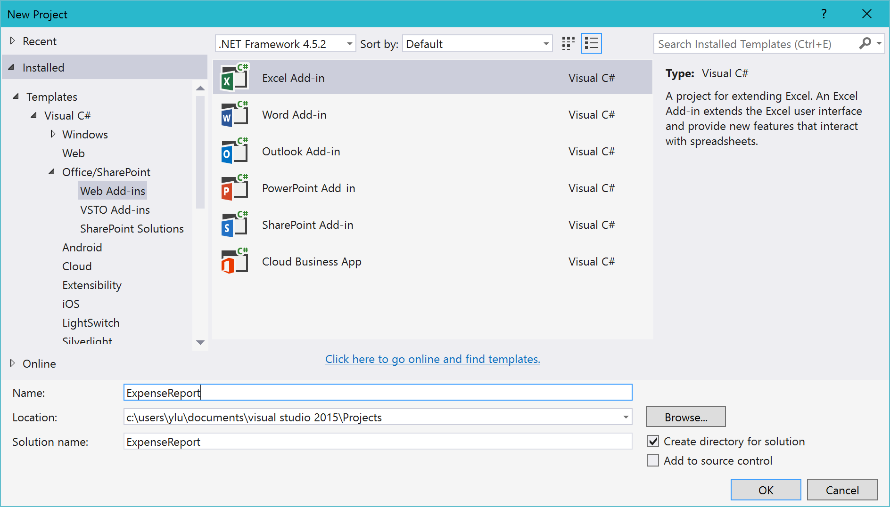
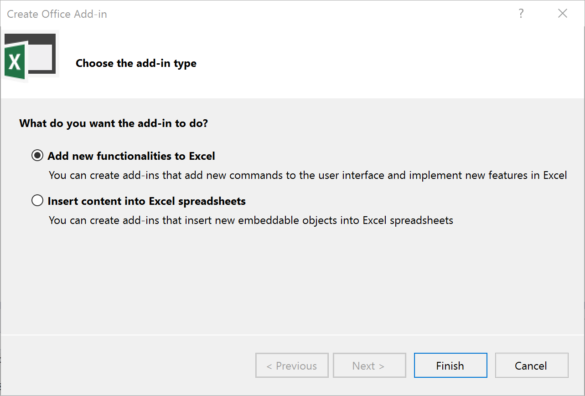

## Exercise 1: Build an Expense Report with the new Excel JavaScript APIs in Office 2016
In this exercise, you will create an Excel add-in that uses the Excel JavaScript API included in Excel 2016. 

> **Note**: For this exercise you must have Excel 2016 Preview, or a later version, installed. Refer to the prerequisites at the beginning of this lab for links on where to obtain Office 2016 Preview.

1. Launch Visual Studio 2015 as administrator.
1. From the **File** menu select the **New Project** command. When the **New Project** dialog appears, select the **Excel Add-in** project template from the **Office/SharePoint** template folder, as shown below. Name the new project **ExpenseReport** and click **OK** to create the new project.
2. 	

1. When you create a new Office Add-ins project, Visual Studio prompts you with the **Choose the add-in type** page of the **Create Office Add-in** dialog. This is the point where you select the type of add-in you want to create. Leave the default setting with the radio button titled **Add new functionalities to Excel** and select **Finish** to continue.

	


1. Reference the Excel JavaScript API in the add-in:
	1. Locate and open the homepage for the add-in: **Home.html**.
	1. Immediately after the reference to `Office.js` in the `<head>` portion of the page, add the following two script references to the Excel JavaScript API beta CDN:

		````html
    <script src="https://appsforoffice.microsoft.com/lib/beta/hosted/office.js"></script>
		````

	> **Note:** Eventually the all Excel JavaScript APIs will be merged into the single `Office.js` file so this step will not be necessary, but in the 1.2 API preview timeframe it is required as an extra step.

1. Now update the UI for the add-in:
	1. Locate the `<body>` section of the page within the `home.html` file.
	1. Replace the contents of the `<body>` with the following markup:

		````html
	    <div id="content-main">
        <div class="padding">
            <br />

            <button class="ms-Button ms-Button--primary" id="insertData">
                <span class="ms-Button-icon"><i class="ms-Icon ms-Icon--plus"></i></span>
                <span class="ms-Button-label" id="button-text">Insert Data</span>
                <span class="ms-Button-description" id="button-desc">Inseart Data, add a table and adjust layout</span>
            </button>
        <br />
            <br />
            <button class="ms-Button ms-Button--primary" id="sort">
                <span class="ms-Button-icon"><i class="ms-Icon ms-Icon--plus"></i></span>
                <span class="ms-Button-label" id="button-text">Sort</span>
                <span class="ms-Button-description" id="button-desc">Sort my data based on transaction date</span>
            </button>
            <br />
            <br />
            <button class="ms-Button ms-Button--primary" id="filter">
                <span class="ms-Button-icon"><i class="ms-Icon ms-Icon--plus"></i></span>
                <span class="ms-Button-label" id="button-text">Filter</span>
                <span class="ms-Button-description" id="button-desc">Only show my transtions in fuel and education</span>
            </button>
            <br />
            <br />
            <button class="ms-Button ms-Button--primary" id="report">
                <span class="ms-Button-icon"><i class="ms-Icon ms-Icon--plus"></i></span>
                <span class="ms-Button-label" id="button-text">Report</span>
                <span class="ms-Button-description" id="button-desc">Create a report on my spending and Protect the report </span>
            </button>
        </div>
    </div>
		````

1. The next step is to code the business logic for the add-in.
	1. Locate the **Home.js** file.
	1. Remove all the sample code except the add-in initialization code so all that is left is the following:

		````javascript
(function () {
    "use strict";


    // The initialize function must be run each time a new page is loaded.
    Office.initialize = function (reason) {
        $(document).ready(function () {
            // Initialize the FabricUI notification mechanism and hide it
            var element = document.querySelector('.ms-MessageBanner');
            messageBanner = new fabric.MessageBanner(element);
            messageBanner.hideBanner();


            // attach click handlers to the workbook
            // TODO-1

            // TODO-2

            // TODO-3

            // TODO-4

            return;

            

        });
    }

    // Helper function for treating errors
    function errorHandler(error) {
        // Always be sure to catch any accumulated errors that bubble up from the Excel.run execution
        showNotification("Error", error);
        console.log("Error: " + error);
        if (error instanceof OfficeExtension.Error) {
            console.log("Debug info: " + JSON.stringify(error.debugInfo));
        }
    }

    // Helper function for displaying notifications
    function showNotification(header, content) {
        $("#notificationHeader").text(header);
        $("#notificationBody").text(content);
        messageBanner.showBanner();
        messageBanner.toggleExpansion();
    }
})();

		````


	1. Now add a function that will add data:
		1. Replace the comment `// TODO-1` with the following jQuery code that creates a click event handler on one of the buttons in the `home.html` page you added previously:

			````javascript
			 $('#insertData').click(insertData);
			````

		1. Next, add the following function.

			Notice how the code in this function is very different from the code in the previous exercises. The Excel  JavaScript API uses a context (`Excel.run()`) to allow you to batch multiple operations (such as `context.workbook.worksheets.add()`) that will be sent to the hosting Excel client application for processing at one time using the `context.sync()` method:

			````javascript
		  function insertData() {
        Excel.run(function (ctx) {

        	// Get the current worksheet
            var sheet = ctx.workbook.worksheets.getActiveWorksheet();

            //Rename the current Worsheet to Data
            sheet.name = "Data";

            //Insert Data
            var range = sheet.getRange("A1:E11");
            range.values = [[
            "Date",
            "Merchant",
            "Category",
            "Sub-Category",
            "Amount"],
			  [
			    "01/12/2014",
			    "WHOLE FOODS MARKET",
			    "Merchandise & Supplies",
			    "Groceries",
			   "84.99"
			  ],
			  [
			    "01/13/2014",
			    "COSTCO GAS",
			    "Transportation",
			    "Fuel",
			   "52.20"
			  ],
			  [
			    "01/13/2014",
			    "COSTCO WHOLESALE",
			    "Merchandise & Supplies",
			    "Wholesale Stores",
			   "163.67"
			  ],
			  [
			    "01/13/2014",
			    "ITUNES",
			    "Merchandise & Supplies",
			    "Internet Purchase",
			   "9.83"
			  ],
			  [
			    "01/13/2014",
			    "SMITH BROTHERS FARMS INC",
			    "Merchandise & Supplies",
			    "Groceries",
			   "21.45"
			  ],
			  [
			    "01/14/2014",
			    "SHELL",
			    "Transportation",
			    "Fuel",
			    "44.00"
			  ],
			  [
			    "01/14/2014",
			    "WHOLE FOODS MARKET",
			    "Merchandise & Supplies",
			    "Groceries",
			   "17.98"
			  ],
			  [
			    "01/15/2014",
			    "BRIGHT EDUCATION SERVICES",
			    "Other",
			    "Education",
			   "59.92"
			  ],
			  [
			    "01/15/2014",
			    "BRIGHT EDUCATION SERVICES",
			    "Other",
			    "Education",
			   "59.92"
			  ],
			  [
			    "01/17/2014",
			    "SMITH BROTHERS FARMS INC-HQ",
			    "Merchandise & Supplies",
			    "Groceries",
			   "21.45"
			  ]];

			//Autofit row height and column width
            range.getEntireColumn().format.autofitColumns();
            range.getEntireRow().format.autofitRows();

            // Add a table
            var table = ctx.workbook.tables.add("Data!A1:E11", true);
            return ctx.sync().then(function () {
           });
        }).catch(function (error) {
            console.log("Error: " + error);
            if (error instanceof OfficeExtension.Error) {
                console.log("Debug info: " + JSON.stringify(error.debugInfo));
            }
        });
    }

			````

1. Now add functionality to sort data based on transaction date:
	1. Go back to the `Office.initialize` statement and replace the comment `// TODO-2` with the following jQuery code that creates a click handler for the button that will add a range of unformatted data to the current worksheet:

	````javascript
            $('#sort').click(sort);
	````

	1. Next, add the following function.

````javascript
	     function sort() {
        Excel.run(function (ctx) {
            var sheet = ctx.workbook.worksheets.getActiveWorksheet();

            // Only Sort the range that has data
            var sortRange = sheet.getRange("A1:E1").getEntireColumn().getUsedRange();
            // Apply sorting on the first column and in descending order
            sortRange.sort.apply([
            {
                key: 0,
                ascending: false,
            },
            ]);
            return ctx.sync().then(function () {
            })
        }).catch(function (error) {
            console.log("Error: " + error);
            if (error instanceof OfficeExtension.Error) {
                console.log("Debug info: " + JSON.stringify(error.debugInfo));
            }
        });
    }
````

1. Then we add functionality to filter data. We only want to focus on the transaction in the sub-category of Fuel and Education.
	1. Go back to the `Office.initialize` statement and replace the comment `// TODO-3` with the following jQuery code that creates a click handler for the button that will add a range of unformatted data to the current worksheet:

	````javascript
	  $('#filter').click(filter);
	````

	1. Next, add the following function.

		Notice how the code works with ranges in a similar way to the last function, but this one assigns some formats to the range's `numberFormats` property:

````javascript
    function filter() {
        Excel.run(function (ctx) {
            var sheet = ctx.workbook.worksheets.getActiveWorksheet();
            var table = sheet.tables.getItemAt(0);

            //Apply a value filter on the 4th column, which is sub-category. We want to focus on transactions in the category of Fuel and Education
            var filter = table.columns.getItemAt(3).filter;
            filter.applyValuesFilter(["Fuel","Education"]);
            return ctx.sync().then(function () {
            })
        }).catch(function (error) {
            console.log("Error: " + error);
            if (error instanceof OfficeExtension.Error) {
                console.log("Debug info: " + JSON.stringify(error.debugInfo));
            }
        });
    }
````

1. Next we add functionality to use Excel formulas and charting to generate a report and then protect the report from editing. Here we first create a new sheet named "Summary", then create a summary table with total spendings based on Category. We then add a chart to visualize the data. Finally we protect the sheet from further changes.
	1. Go back to the `Office.initialize` statement and replace the comment `// TODO-4` with the following jQuery code that creates a click handler for the button that will add a range of unformatted data to the current worksheet:

	````javascript
	  $('#report').click(report);
	````
	1. Next, add the following function.

		Notice how the code works with ranges in a similar way to the last function, but this one assigns some formats to the range's `numberFormats` property:

		````javascript
 function report() {
        Excel.run(function (ctx) {
            //Add a new worksheet
            var sheet = ctx.workbook.worksheets.add("Summary");
            //Activate the worksheet
            sheet.activate();

            // Use Excel formulas to calculate the total spending based on categories
            var sumRange = sheet.getRange("A1:B6");
            sumRange.values = [['Category', 'Total'],
            ['Groceries', '=SUMIF( Data!D2:D100, "Groceries", Data!E2:E100 )'],
            ['Fuel', '=SUMIF( Data!D2:D100, "Fuel", Data!E2:E100 )'],
            ['Wholesale Store', '=SUMIF( Data!D2:D100, "Wholesale Stores", Data!E2:E100 )'],
            ['Internet Purchase', '=SUMIF( Data!D2:D100, "Internet Purchase", Data!E2:E100 )'],
            ['Education', '=SUMIF( Data!D2:D100, "Education", Data!E2:E100 )']];

            //Add a Table
            ctx.workbook.tables.add("Summary!A1:B6", true);

            // Add a pie chart
            var chartRange = sheet.getRange("A1:B6");
            var chart = ctx.workbook.worksheets.getItem("Summary").charts.add("Pie", chartRange);

            //Update the chart title
            chart.title.text = "Spending based on catagory";

            // Protect the report from editing
            sheet.protection.protect();

            return ctx.sync().then(function () {

            })
            .then(ctx.sync);
        }).catch(function (error) {
            console.log("Error: " + error);
            if (error instanceof OfficeExtension.Error) {
                console.log("Debug info: " + JSON.stringify(error.debugInfo));
            }
        });
    }
	````


###Test the Add-in
1. 	Now deploy the Excel add-in to the local Excel client:
  1. Select the **ExcelWebAddIn1** project within the **Solution Explorer** tool window.
  1. Within the **Properties** window, set the **Start Action** selector to **Office Desktop Client** and press **F5** to start the project.
  1. Visual Studio will launch the Excel desktop client and create a new Excel workbook.
1. 	Enter a name for a new worksheet and click the button **Add a New Worksheet**. 

	Notice how Excel creates a new blank worksheet and changes focus to that worksheet.

1. 	Now, make sure you have a few worksheets in the workbook and then click the button **Add Range of Data**.

	Notice how Excel creates a list of all the worksheets starting with cell **A1** in the current worksheet, but it adds a title to the worksheet at the top.

1. Finally, click the button **Add Formatted Data Range**.

	Notice how Excel creates a new table of data in the middle of the worksheet, but the dates and currency values are formatted accordingly.

Congratulations! You've now written an Excel add-in that uses the new Excel JavaScript API.

