# Excel REST API 

The purpose of this lab is to show step-by-step instruction for reading writing into an Excel document stored in your OneDrive Business using new Excel REST APIs. We'll use Visual Studio MVC project to showcase the interaction. 

* [Lab instructions](#lab-instructions)
    * [Create a new project](#create-a-new-project)
    * [Add ToDo file to new Assets folder](#Add-ToDo-file-to-new-Assets-folder)
    * [Use Excel REST API](#use-excel-rest-api)
        * [Add new controllers](#add-new-controllers)
        * [Add model](#add-model)
        * [Update Shared folder](#update-shared-folder)
        * [Create Helpers](#create-helpers)                            
    * [Run project](#run-project)
        * [View source Excel file](#view-source-excel-file) 
* [Overview of Excel API](#overview-of-excel-api)

## Lab instructions 

### Create a new project 

In this first step, you will create a new ASP.NET MVC project using the **Graph AAD Auth v1 Starter Project** template and log in to your app and generate access tokens
for calling the Graph API.

1. Launch Visual Studio 2015 and select **New**, **Project**.
  1. Search the installed templates for **Graph** and select the **Graph AAD Auth v1 Starter Project** template.
  1. Name the new project **ExcelRestAPI-ToDoList** and click **OK**.

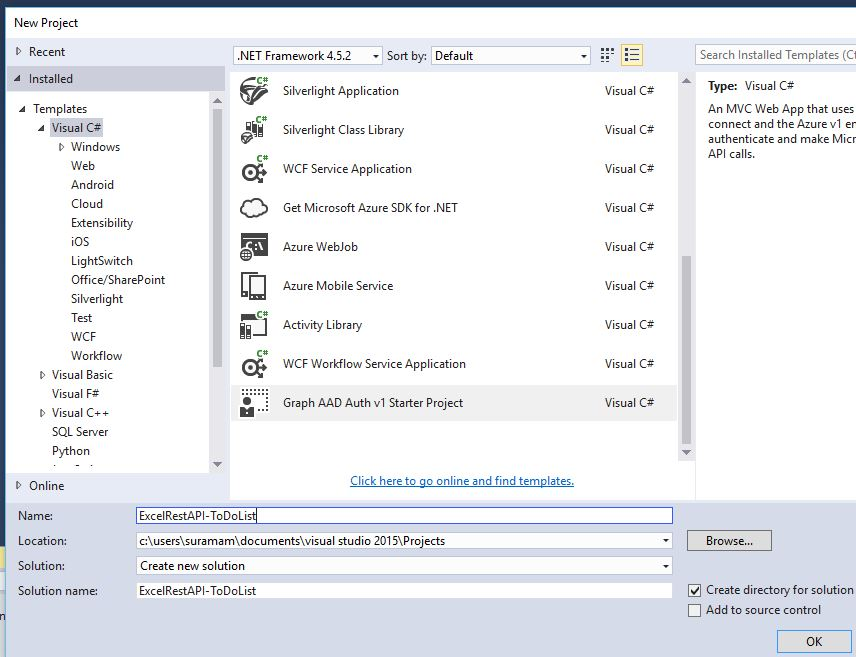
   
1. Press F5 to compile and launch your new application in the default browser.
  1. Once the Graph and AAD Auth Endpoint Starter page appears, click **Sign in** and login to your Office 365 administrator account.
  1. Review the permissions the application is requesting, and click **Accept**.
  1. Now that you are signed into your application, exercise 1 is complete!
  1. Note that this sample only ensured that you were able to launch the project and use the login using the pre-defined client Id and secret. If you wish to use your own client Id and secret, edit the webconf.xml and add your own values under `configuration` > `appSettings` segment. 
  
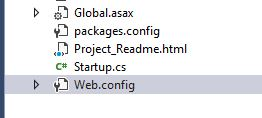   
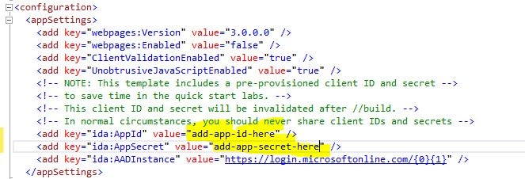

### Add ToDo file to new Assets folder

Add an *Assets* folder to your project, drop the ToDo.xlsx file included in this lab into that new folder, and add the file to your project.


### Use Excel REST API.

Let's create a MVC web application that allows us to create and manage to-do list by storing the content into an Excel file. 
The high level functions performed by the application includes: 

1. Create an Excel file in your personal OneDrive Business account, named `ToDoList.xlsx`. If you run this the second time, it will re-use the file already created. 
1. Allows you to create new tasks by adding related task details. 
1. Lists all of the tasks created. 
1. Get insights into the tasks by viewing the breakdown through an Excel chart image that is created and downloaded using the Excel API. 

In order to achieve above functions, the app calls Excel API as described in below sections. 

#### Add new controllers 

1. Under `Controllers` folder, add the following two C# files.
  1. ToDoListController.cs - this is the controller that manages the main page actions.
  1. ChartController.cs - this is the controlled that manages the chart page actions. 

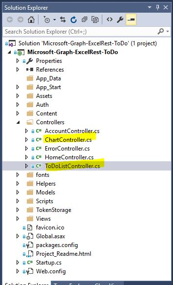

##### `ToDoListController.cs` contents 
   
```csharp
using System.Collections.Generic;
using System.Web.Mvc;
using System.Threading.Tasks;
using System;
using ExcelRestAPI_ToDoList.TokenStorage;
using ExcelRestAPI_ToDoList.Auth;
using System.Configuration;

namespace Microsoft_Graph_ExcelRest_ToDo.Controllers
{
    public class ToDoListController : Controller
    {

        //
        // GET: ToDoList
        public async Task<ActionResult> Index()
        {
            string userObjId = System.Security.Claims.ClaimsPrincipal.Current.FindFirst("http://schemas.microsoft.com/identity/claims/objectidentifier").Value;
            SessionTokenCache tokenCache = new SessionTokenCache(userObjId, HttpContext);

            string tenantId = System.Security.Claims.ClaimsPrincipal.Current.FindFirst("http://schemas.microsoft.com/identity/claims/tenantid").Value;
            string authority = string.Format(ConfigurationManager.AppSettings["ida:AADInstance"], tenantId, "");
            AuthHelper authHelper = new AuthHelper(authority, ConfigurationManager.AppSettings["ida:AppId"], ConfigurationManager.AppSettings["ida:AppSecret"], tokenCache);
            string accessToken = await authHelper.GetUserAccessToken(Url.Action("Index", "Home", null, Request.Url.Scheme));

            await RESTAPIHelper.LoadWorkbook(accessToken);

            return View(await RESTAPIHelper.GetToDoItems(accessToken));
        }

        // GET: ToDoList/Create
        public ActionResult Create()
        {
            var priorityList = new SelectList(new[]
                                          {
                                              new {ID="1",Name="High"},
                                              new{ID="2",Name="Normal"},
                                              new{ID="3",Name="Low"},
                                          },
                            "ID", "Name", 1);
            ViewData["priorityList"] = priorityList;

            var statusList = new SelectList(new[]
                              {
                                              new {ID="1",Name="Not started"},
                                              new{ID="2",Name="In-progress"},
                                              new{ID="3",Name="Completed"},
                                          },
                "ID", "Name", 1);
            ViewData["statusList"] = statusList;

            return View();
        }

        // POST: ToDoList/Create
        [HttpPost]
        public async Task<ActionResult> Create(FormCollection collection)
        {
            try
            {

                string userObjId = System.Security.Claims.ClaimsPrincipal.Current.FindFirst("http://schemas.microsoft.com/identity/claims/objectidentifier").Value;
                SessionTokenCache tokenCache = new SessionTokenCache(userObjId, HttpContext);

                string tenantId = System.Security.Claims.ClaimsPrincipal.Current.FindFirst("http://schemas.microsoft.com/identity/claims/tenantid").Value;
                string authority = string.Format(ConfigurationManager.AppSettings["ida:AADInstance"], tenantId, "");
                AuthHelper authHelper = new AuthHelper(authority, ConfigurationManager.AppSettings["ida:AppId"], ConfigurationManager.AppSettings["ida:AppSecret"], tokenCache);
                string accessToken = await authHelper.GetUserAccessToken(Url.Action("Index", "Home", null, Request.Url.Scheme));

                await RESTAPIHelper.CreateToDoItem(
                    accessToken,
                    collection["Title"],
                    collection["PriorityDD"],
                    collection["StatusDD"],
                    collection["PercentComplete"],
                    collection["StartDate"],
                    collection["EndDate"],
                    collection["Notes"]);
                return RedirectToAction("Index");
            }
            catch
            {
                return View();
            }
        }

    }
}
```


##### `ChartController.cs` contents 

```csharp
using System;
using System.Collections.Generic;
using System.Linq;
using System.Web;
using System.Web.Mvc;
using System.Threading.Tasks;
using ExcelRestAPI_ToDoList.TokenStorage;
using ExcelRestAPI_ToDoList.Auth;
using System.Configuration;

namespace Microsoft_Graph_ExcelRest_ToDo.Controllers
{
    public class ChartController : Controller
    {
        public async Task<FileResult> GetChart()
        {
            string userObjId = System.Security.Claims.ClaimsPrincipal.Current.FindFirst("http://schemas.microsoft.com/identity/claims/objectidentifier").Value;
            SessionTokenCache tokenCache = new SessionTokenCache(userObjId, HttpContext);

            string tenantId = System.Security.Claims.ClaimsPrincipal.Current.FindFirst("http://schemas.microsoft.com/identity/claims/tenantid").Value;
            string authority = string.Format(ConfigurationManager.AppSettings["ida:AADInstance"], tenantId, "");
            AuthHelper authHelper = new AuthHelper(authority, ConfigurationManager.AppSettings["ida:AppId"], ConfigurationManager.AppSettings["ida:AppSecret"], tokenCache);
            string accessToken = await authHelper.GetUserAccessToken(Url.Action("Index", "Home", null, Request.Url.Scheme));


            return await RESTAPIHelper.getChartImage(accessToken);
        }
    }
}
```

#### Add model 

Add a new file under `Models` folder called `ToDoItem.cs`

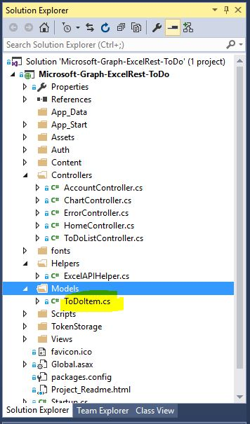

##### `ToDoItem.cs` contents 
```csharp
using System;
using System.Collections.Generic;
using System.ComponentModel.DataAnnotations;
using System.Linq;
using System.Web;
using Newtonsoft.Json.Serialization;
using Newtonsoft.Json;

namespace Microsoft_Graph_ExcelRest_ToDo.Models
{
    public class ToDoItem
    {
        [JsonProperty("index")]
        public string Id { get; set; }
        [Required]
        public string Title { get; set; }

        [Required]
        public string Status { get; set; }

        [Required]
        public string Priority { get; set; }

        [Required]
        public string PercentComplete { get; set; }

        [Required]
        public string StartDate { get; set; }

        [Required]
        public string EndDate { get; set; }

        [DataType(DataType.MultilineText)]
        public string Notes { get; set; }

        public ToDoItem(
            string id,
            string title,
            string priority,
            string status,
            string percentComplete,
            string startDate,
            string endDate,
            string notes)
        {
            Id = id;
            Title = title;
            Priority = priority;
            Status = status;
            if (!percentComplete.EndsWith("%"))
                PercentComplete = percentComplete + "%";
            else
                PercentComplete = percentComplete;

            StartDate = startDate;
            EndDate = endDate;
            Notes = notes;
        }

        public ToDoItem() { }
    }
}
```

#### Add views 

Create new views for To-Do list and Chart pages. 

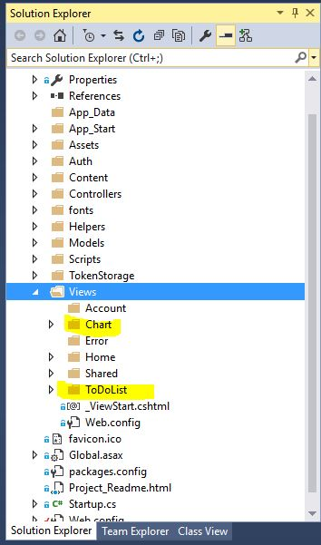

##### Create `Chart` folder and add view `View.cshtml`

`View.cshtml`


```cshtml
@{
    ViewBag.Title = "View";
    Layout = "~/Views/Shared/_Layout.cshtml";
}

<h2>Percent Complete Chart</h2>


```

##### Create `ToDoList` folder and view `Create.cshtml` and `Index.cshtml`

`Create.cshtml`

```cshtml
@model Microsoft_Graph_ExcelRest_ToDo.Models.ToDoItem

@{
    ViewBag.Title = "Create";
    Layout = "~/Views/Shared/_Layout.cshtml";
}

<h2>Create</h2>

@using (Html.BeginForm())
{

    <div class="form-horizontal">
        <h4>ToDoItem</h4>
        <hr />
        @Html.ValidationSummary(true, "", new { @class = "text-danger" })
        <div class="form-group">
            @Html.LabelFor(model => model.Title, htmlAttributes: new { @class = "control-label col-md-2" })
            <div class="col-md-10">
                @Html.EditorFor(model => model.Title, new { htmlAttributes = new { @class = "form-control" } })
                @Html.ValidationMessageFor(model => model.Title, "", new { @class = "text-danger" })
            </div>
        </div>

        <div class="form-group">
            @Html.LabelFor(model => model.Priority, htmlAttributes: new { @class = "control-label col-md-2" })
            <div class="col-md-10">
                @Html.DropDownList("PriorityDD", ViewData["priorityList"] as SelectList)
            </div>
        </div>

        <div class="form-group">
            @Html.LabelFor(model => model.Status, htmlAttributes: new { @class = "control-label col-md-2" })
            <div class="col-md-10">
                @Html.DropDownList("StatusDD", ViewData["statusList"] as SelectList)
            </div>
        </div>

        <div class="form-group">
            @Html.LabelFor(model => model.PercentComplete, htmlAttributes: new { @class = "control-label col-md-2" })
            <div class="col-md-10">
                @Html.EditorFor(model => model.PercentComplete, new { htmlAttributes = new { @class = "form-control" } })
            </div>

        </div>

        <div class="form-group">
            @Html.LabelFor(model => model.StartDate, htmlAttributes: new { @class = "control-label col-md-2" })
            <div class="col-md-10">
                @Html.EditorFor(model => model.StartDate, new { htmlAttributes = new { @class = "form-control" } })
                @Html.ValidationMessageFor(model => model.StartDate, "", new { @class = "text-danger" })
            </div>
        </div>

        <div class="form-group">
            @Html.LabelFor(model => model.EndDate, htmlAttributes: new { @class = "control-label col-md-2" })
            <div class="col-md-10">
                @Html.EditorFor(model => model.EndDate, new { htmlAttributes = new { @class = "form-control" } })
                @Html.ValidationMessageFor(model => model.EndDate, "", new { @class = "text-danger" })
            </div>
        </div>

        <div class="form-group">
            @Html.LabelFor(model => model.Notes, htmlAttributes: new { @class = "control-label col-md-2" })
            <div class="col-md-10">
                @Html.EditorFor(model => model.Notes, new { htmlAttributes = new { @class = "form-control" } })
                @Html.ValidationMessageFor(model => model.Notes, "", new { @class = "text-danger" })
            </div>
        </div>

        <div class="form-group">
            <div class="col-md-offset-2 col-md-10">
                <input type="submit" value="Create" class="btn btn-default" />
            </div>
        </div>
    </div>
}


<div>
    @Html.ActionLink("Back to To Do List", "Index")
</div>


<link rel="stylesheet" href="//code.jquery.com/ui/1.11.4/themes/smoothness/jquery-ui.css">
<script src="//code.jquery.com/jquery-1.10.2.js"></script>
<script src="//code.jquery.com/ui/1.11.4/jquery-ui.js"></script>
<script>
    var now = new Date();
    var startDate = now.toLocaleDateString();
    $('#StartDate').val(startDate);
    $('#StartDate').datepicker({ dateFormat: 'm/d/yy' }).toLocaleString();
    $('#EndDate').datepicker({ dateFormat: 'm/d/yy' }).toLocaleString();;
    $('#PercentComplete').val(0);
</script>

```

`Index.cshtml`

```cshtml
@model IEnumerable<Microsoft_Graph_ExcelRest_ToDo.Models.ToDoItem>

@{
    ViewBag.Title = "Index";
    Layout = "~/Views/Shared/_Layout.cshtml";
}

<h2>To Do List</h2>

<table class="table">
    <tr>
        <th>
            @Html.DisplayNameFor(model => model.Id)
        </th>
        <th>
            @Html.DisplayNameFor(model => model.Title)
        </th>
        <th>
            @Html.DisplayNameFor(model => model.Priority)
        </th>
        <th>
            @Html.DisplayNameFor(model => model.Status)
        </th>
        <th>
            @Html.DisplayNameFor(model => model.PercentComplete)
        </th>
        <th>
            @Html.DisplayNameFor(model => model.StartDate)
        </th>
        <th>
            @Html.DisplayNameFor(model => model.EndDate)
        </th>
        <th>
            @Html.DisplayNameFor(model => model.Notes)
        </th>
        <th></th>
    </tr>

    @foreach (var item in Model)
    {
        <tr>
            <td>
                @Html.DisplayFor(modelItem => item.Id)
            </td>
            <td>
                @Html.DisplayFor(modelItem => item.Title)
            </td>
            <td>
                @Html.DisplayFor(modelItem => item.Priority)
            </td>
            <td>
                @Html.DisplayFor(modelItem => item.Status)
            </td>
            <td>
                @Html.DisplayFor(modelItem => item.PercentComplete)
            </td>
            <td>
                @Html.DisplayFor(modelItem => item.StartDate)
            </td>
            <td>
                @Html.DisplayFor(modelItem => item.EndDate)
            </td>
            <td>
                @Html.DisplayFor(modelItem => item.Notes)
            </td>
        </tr>
    }

</table>

<p>
    @Html.ActionLink("Charts", "GetChart", "Chart")
</p>

<p>
    <span>@Html.ActionLink("Refresh", "Index")</span><span> | </span><span></span>@Html.ActionLink("Add new", "Create")<span></span>
</p>

```

#### Update Shared folder

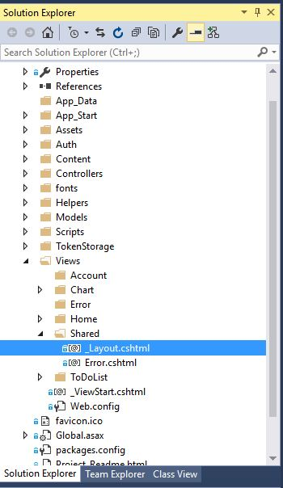

Open the _Layout.cshtml file and find this block:

```cshtml
                    <li>@Html.ActionLink("Home", "Index", "Home")</li>
                    <li>@Html.ActionLink("About", "About", "Home")</li>
                    <li>@Html.ActionLink("Contact", "Contact", "Home")</li>
                    <li>@Html.ActionLink("Graph API", "Graph", "Home")</li>
```

Add this line at the end of that block:

```cshtml
<li>@Html.ActionLink("ToDoList", "Index", "ToDoList")</li>
```

#### Create Helpers

Create a new project folder called `Helpers` and add a file named `ExcelAPIHelper.cs`. Include below contents. 

A detailed explanation is provided for each of the important functions of this helper class. 

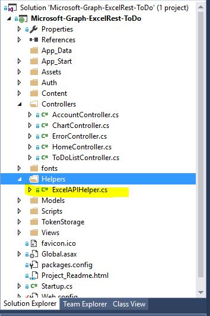

##### `ExcelAPIHelper.cs` contents

```csharp
using Newtonsoft.Json.Linq;
using System;
using System.Collections.Generic;
using System.Linq;
using System.Net.Http;
using System.Net.Http.Headers;
using System.Threading.Tasks;
using Microsoft_Graph_ExcelRest_ToDo.Models;
using Newtonsoft.Json;
using System.Drawing;
using System.IO;
using System.Web;
using System.Web.Mvc;

namespace Microsoft_Graph_ExcelRest_ToDo
{
    public class RESTAPIHelper
    {
        private static string restURLBase = "https://graph.microsoft.com/testexcel/me/drive/items/";
        private static string fileId = null;

        public static async Task LoadWorkbook(string accessToken)
        {
            try
            {
                var fileName = "ToDoList.xlsx";
                var serviceEndpoint = "https://graph.microsoft.com/v1.0/me/drive/root/children";
                //string fileId = null;

                String absPath = HttpContext.Current.Server.MapPath("Assets/ToDo.xlsx");
                HttpClient client = new HttpClient();
                client.DefaultRequestHeaders.Authorization = new AuthenticationHeaderValue("Bearer", accessToken);


                var filesResponse = await client.GetAsync(serviceEndpoint + "?$select=name,id");

                if (filesResponse.IsSuccessStatusCode)
                {
                    var filesContent = await filesResponse.Content.ReadAsStringAsync();

                    JObject parsedResult = JObject.Parse(filesContent);

                    foreach (JObject file in parsedResult["value"])
                    {

                        var name = (string)file["name"];
                        if (name.Contains("ToDoList.xlsx"))
                        {
                            fileId = (string)file["id"];
                            restURLBase = "https://graph.microsoft.com/testexcel/me/drive/items/" + fileId + "/workbook/worksheets('ToDoList')/";
                            return;
                        }
                    }

                }

                else
                {
                    Console.WriteLine("Could not get user files:" + filesResponse.StatusCode);
                }

                // We know that the file doesn't exist, so upload it and create the necessary worksheets, tables, and chart.
                var excelFile = File.OpenRead(absPath);
                byte[] contents = new byte[excelFile.Length];
                excelFile.Read(contents, 0, (int)excelFile.Length); excelFile.Close();
                var contentStream = new MemoryStream(contents);


                var contentPostBody = new StreamContent(contentStream);
                contentPostBody.Headers.Add("Content-Type", "application/octet-stream");


                // Endpoint for content in an existing file.
                var fileEndpoint = new Uri(serviceEndpoint + "/" + fileName + "/content");

                var requestMessage = new HttpRequestMessage(HttpMethod.Put, fileEndpoint)
                {
                    Content = contentPostBody
                };

                HttpResponseMessage response = await client.SendAsync(requestMessage);

                if (response.IsSuccessStatusCode)
                {
                    var responseContent = await response.Content.ReadAsStringAsync();
                    var parsedResponse = JObject.Parse(responseContent);
                    fileId = (string)parsedResponse["id"];
                    restURLBase = "https://graph.microsoft.com/testexcel/me/drive/items/" + fileId + "/workbook/worksheets('ToDoList')/";

                    var workbookEndpoint = "https://graph.microsoft.com/testexcel/me/drive/items/" + fileId + "/workbook";

                    //Get session id

                    var sessionJson = "{" +
                        "'saveChanges': true" +
                        "}";
                    var sessionContentPostbody = new StringContent(sessionJson);
                    sessionContentPostbody.Headers.Clear();
                    sessionContentPostbody.Headers.Add("Content-Type", "application/json");
                    var sessionResponseMessage = await client.PostAsync(workbookEndpoint + "/createsession", sessionContentPostbody);
                    var sessionResponseContent = await sessionResponseMessage.Content.ReadAsStringAsync();
                    JObject sessionObject = JObject.Parse(sessionResponseContent);
                    var sessionId = (string)sessionObject["id"];

                    client.DefaultRequestHeaders.Add("Workbook-Session-Id", sessionId);


                    var worksheetsEndpoint = "https://graph.microsoft.com/testexcel/me/drive/items/" + fileId + "/workbook/worksheets";

                    //Worksheets
                    var toDoWorksheetJson = "{" +
                                                "'name': 'ToDoList'," +
                                                "}";

                    var toDoWorksheetContentPostBody = new StringContent(toDoWorksheetJson);
                    toDoWorksheetContentPostBody.Headers.Clear();
                    toDoWorksheetContentPostBody.Headers.Add("Content-Type", "application/json");
                    var toDoResponseMessage = await client.PostAsync(worksheetsEndpoint, toDoWorksheetContentPostBody);


                    var summaryWorksheetJson = "{" +
                            "'name': 'Summary'" +
                            "}";

                    var summaryWorksheetContentPostBody = new StringContent(summaryWorksheetJson);
                    summaryWorksheetContentPostBody.Headers.Clear();
                    summaryWorksheetContentPostBody.Headers.Add("Content-Type", "application/json");
                    var summaryResponseMessage = await client.PostAsync(worksheetsEndpoint, summaryWorksheetContentPostBody);

                    //ToDoList table in ToDoList worksheet
                    var toDoListTableJson = "{" +
                            "'address': 'A1:H1'," +
                            "'hasHeaders': true" +
                            "}";

                    var toDoListTableContentPostBody = new StringContent(toDoListTableJson);
                    toDoListTableContentPostBody.Headers.Clear();
                    toDoListTableContentPostBody.Headers.Add("Content-Type", "application/json");
                    var toDoListTableResponseMessage = await client.PostAsync(worksheetsEndpoint + "('ToDoList')/tables/$/add", toDoListTableContentPostBody);

                    //New table in Summary worksheet
                    var summaryTableJson = "{" +
                            "'address': 'A1:B1'," +
                            "'hasHeaders': true" +
                            "}";

                    var summaryTableContentPostBody = new StringContent(summaryTableJson);
                    summaryTableContentPostBody.Headers.Clear();
                    summaryTableContentPostBody.Headers.Add("Content-Type", "application/json");
                    var summaryTableResponseMessage = await client.PostAsync(worksheetsEndpoint + "('Summary')/tables/$/add", summaryTableContentPostBody);

                    var patchMethod = new HttpMethod("PATCH");


                    //Rename Table1 in ToDoList worksheet to "ToDoList"
                    var toDoListTableNameJson = "{" +
                            "'name': 'ToDoList'," +
                            "}";

                    var toDoListTableNamePatchBody = new StringContent(toDoListTableNameJson);
                    toDoListTableNamePatchBody.Headers.Clear();
                    toDoListTableNamePatchBody.Headers.Add("Content-Type", "application/json");


                    var toDoListRequestMessage = new HttpRequestMessage(patchMethod, worksheetsEndpoint + "('ToDoList')/tables('Table1')") { Content = toDoListTableNamePatchBody };
                    var toDoListTableNameResponseMessage = await client.SendAsync(toDoListRequestMessage);


                    //Rename ToDoList columns
                    var colToDoOneNameJson = "{" +
                            "'values': [['Id'], [null]] " +
                            "}";

                    var colToDoOneNamePatchBody = new StringContent(colToDoOneNameJson);
                    colToDoOneNamePatchBody.Headers.Clear();
                    colToDoOneNamePatchBody.Headers.Add("Content-Type", "application/json");
                    var colToDoOneNameRequestMessage = new HttpRequestMessage(patchMethod, worksheetsEndpoint + "('ToDoList')/tables('ToDoList')/Columns('1')") { Content = colToDoOneNamePatchBody };
                    var colToDoOneNameResponseMessage = await client.SendAsync(colToDoOneNameRequestMessage);

                    var colToDoTwoNameJson = "{" +
                            "'values': [['Title'], [null]] " +
                            "}";

                    var colToDoTwoNamePatchBody = new StringContent(colToDoTwoNameJson);
                    colToDoTwoNamePatchBody.Headers.Clear();
                    colToDoTwoNamePatchBody.Headers.Add("Content-Type", "application/json");
                    var colToDoTwoNameRequestMessage = new HttpRequestMessage(patchMethod, worksheetsEndpoint + "('ToDoList')/tables('ToDoList')/Columns('2')") { Content = colToDoTwoNamePatchBody };
                    var colToDoTwoNameResponseMessage = await client.SendAsync(colToDoTwoNameRequestMessage);

                    var colToDoThreeNameJson = "{" +
                            "'values': [['Priority'], [null]] " +
                            "}";

                    var colToDoThreeNamePatchBody = new StringContent(colToDoThreeNameJson);
                    colToDoThreeNamePatchBody.Headers.Clear();
                    colToDoThreeNamePatchBody.Headers.Add("Content-Type", "application/json");
                    var colToDoThreeNameRequestMessage = new HttpRequestMessage(patchMethod, worksheetsEndpoint + "('ToDoList')/tables('ToDoList')/Columns('3')") { Content = colToDoThreeNamePatchBody };
                    var colToDoThreeNameResponseMessage = await client.SendAsync(colToDoThreeNameRequestMessage);

                    var colToDoFourNameJson = "{" +
                            "'values': [['Status'], [null]] " +
                            "}";

                    var colToDoFourNamePatchBody = new StringContent(colToDoFourNameJson);
                    colToDoFourNamePatchBody.Headers.Clear();
                    colToDoFourNamePatchBody.Headers.Add("Content-Type", "application/json");
                    var colToDoFourNameRequestMessage = new HttpRequestMessage(patchMethod, worksheetsEndpoint + "('ToDoList')/tables('ToDoList')/Columns('4')") { Content = colToDoFourNamePatchBody };
                    var colToDoFourNameResponseMessage = await client.SendAsync(colToDoFourNameRequestMessage);

                    var colToDoFiveNameJson = "{" +
                            "'values': [['PercentComplete'], [null]] " +
                            "}";

                    var colToDoFiveNamePatchBody = new StringContent(colToDoFiveNameJson);
                    colToDoFiveNamePatchBody.Headers.Clear();
                    colToDoFiveNamePatchBody.Headers.Add("Content-Type", "application/json");
                    var colToDoFiveNameRequestMessage = new HttpRequestMessage(patchMethod, worksheetsEndpoint + "('ToDoList')/tables('ToDoList')/Columns('5')") { Content = colToDoFiveNamePatchBody };
                    var colToDoFiveNameResponseMessage = await client.SendAsync(colToDoFiveNameRequestMessage);

                    var colToDoSixNameJson = "{" +
                            "'values': [['StartDate'], [null]] " +
                            "}";

                    var colToDoSixNamePatchBody = new StringContent(colToDoSixNameJson);
                    colToDoSixNamePatchBody.Headers.Clear();
                    colToDoSixNamePatchBody.Headers.Add("Content-Type", "application/json");
                    var colToDoSixNameRequestMessage = new HttpRequestMessage(patchMethod, worksheetsEndpoint + "('ToDoList')/tables('ToDoList')/Columns('6')") { Content = colToDoSixNamePatchBody };
                    var colToDoSixNameResponseMessage = await client.SendAsync(colToDoSixNameRequestMessage);

                    var colToDoSevenNameJson = "{" +
                            "'values': [['EndDate'], [null]] " +
                            "}";

                    var colToDoSevenNamePatchBody = new StringContent(colToDoSevenNameJson);
                    colToDoSevenNamePatchBody.Headers.Clear();
                    colToDoSevenNamePatchBody.Headers.Add("Content-Type", "application/json");
                    var colToDoSevenNameRequestMessage = new HttpRequestMessage(patchMethod, worksheetsEndpoint + "('ToDoList')/tables('ToDoList')/Columns('7')") { Content = colToDoSevenNamePatchBody };
                    var colToDoSevenNameResponseMessage = await client.SendAsync(colToDoSevenNameRequestMessage);

                    var colToDoEightNameJson = "{" +
                            "'values': [['Notes'], [null]] " +
                            "}";

                    var colToDoEightNamePatchBody = new StringContent(colToDoEightNameJson);
                    colToDoEightNamePatchBody.Headers.Clear();
                    colToDoEightNamePatchBody.Headers.Add("Content-Type", "application/json");
                    var colToDoEightNameRequestMessage = new HttpRequestMessage(patchMethod, worksheetsEndpoint + "('ToDoList')/tables('ToDoList')/Columns('8')") { Content = colToDoEightNamePatchBody };
                    var colToDoEightNameResponseMessage = await client.SendAsync(colToDoEightNameRequestMessage);

                    //Rename Summary columns
                    var colSumOneNameJson = "{" +
                            "'values': [['Status'], [null]] " +
                            "}";

                    var colSumOneNamePatchBody = new StringContent(colSumOneNameJson);
                    colSumOneNamePatchBody.Headers.Clear();
                    colSumOneNamePatchBody.Headers.Add("Content-Type", "application/json");
                    var colSumOneNameRequestMessage = new HttpRequestMessage(patchMethod, worksheetsEndpoint + "('Summary')/tables('2')/Columns('1')") { Content = colSumOneNamePatchBody };
                    var colSumOneNameResponseMessage = await client.SendAsync(colSumOneNameRequestMessage);

                    var colSumTwoNameJson = "{" +
                            "'values': [['Count'], [null]] " +
                            "}";

                    var colSumTwoNamePatchBody = new StringContent(colSumTwoNameJson);
                    colSumTwoNamePatchBody.Headers.Clear();
                    colSumTwoNamePatchBody.Headers.Add("Content-Type", "application/json");
                    var colSumTwoNameRequestMessage = new HttpRequestMessage(patchMethod, worksheetsEndpoint + "('Summary')/tables('2')/Columns('2')") { Content = colSumTwoNamePatchBody };
                    var colSumTwoNameResponseMessage = await client.SendAsync(colSumTwoNameRequestMessage);

                    //Set numberFormat to text for the two date fields

                    var dateRangeJSON = "{" +
                        "'numberFormat': '@'" +
                        "}";
                    var datePatchBody = new StringContent(dateRangeJSON);
                    datePatchBody.Headers.Clear();
                    datePatchBody.Headers.Add("Content-Type", "application/json");
                    var dateRequestMessage = new HttpRequestMessage(patchMethod, worksheetsEndpoint + "('ToDoList')/range(address='$F1:$G1000')") { Content = datePatchBody };
                    var dateResponseMessage = await client.SendAsync(dateRequestMessage);


                    //Add rows to summary table

                    var summaryTableNSRowJson = "{" +
                            "'values': [['Not started', '=COUNTIF(ToDoList[PercentComplete],[@Status])']]" +
                        "}";
                    var summaryTableNSRowContentPostBody = new StringContent(summaryTableNSRowJson, System.Text.Encoding.UTF8);
                    summaryTableNSRowContentPostBody.Headers.Clear();
                    summaryTableNSRowContentPostBody.Headers.Add("Content-Type", "application/json");

                    var summaryTableNSRowResponseMessage = await client.PostAsync(worksheetsEndpoint + "('Summary')/tables('2')/rows", summaryTableNSRowContentPostBody);

                    var summaryTableNSRowTwoJson = "{" +
                            "'values': [['In-progress', '=COUNTIF(ToDoList[PercentComplete],[@Status])']]" +
                        "}";
                    var summaryTableNSRowTwoContentPostBody = new StringContent(summaryTableNSRowTwoJson, System.Text.Encoding.UTF8);
                    summaryTableNSRowTwoContentPostBody.Headers.Clear();
                    summaryTableNSRowTwoContentPostBody.Headers.Add("Content-Type", "application/json");

                    var summaryTableNSRowTwoResponseMessage = await client.PostAsync(worksheetsEndpoint + "('Summary')/tables('2')/rows", summaryTableNSRowTwoContentPostBody);

                    var summaryTableNSRowThreeJson = "{" +
                            "'values': [['Completed', '=COUNTIF(ToDoList[PercentComplete],[@Status])']]" +
                        "}";
                    var summaryTableNSRowThreeContentPostBody = new StringContent(summaryTableNSRowThreeJson, System.Text.Encoding.UTF8);
                    summaryTableNSRowThreeContentPostBody.Headers.Clear();
                    summaryTableNSRowThreeContentPostBody.Headers.Add("Content-Type", "application/json");

                    var summaryTableNSRowThreeResponseMessage = await client.PostAsync(worksheetsEndpoint + "('Summary')/tables('2')/rows", summaryTableNSRowThreeContentPostBody);

                    //Add chart to Summary worksheet
                    var chartJson = "{" +
                        "\"type\": \"Pie\", " +
                        "\"sourcedata\": \"A1:B4\", " +
                        "\"seriesby\": \"Auto\"" +
                        "}";

                    var chartContentPostBody = new StringContent(chartJson);
                    chartContentPostBody.Headers.Clear();
                    chartContentPostBody.Headers.Add("Content-Type", "application/json");
                    var chartCreateResponseMessage = await client.PostAsync(worksheetsEndpoint + "('Summary')/charts/$/add", chartContentPostBody);

                    //Update chart position and title
                    var chartPatchJson = "{" +
                        "'left': 99," +
                        "'name': 'Status'," +
                        "}";

                    var chartPatchBody = new StringContent(chartPatchJson);
                    chartPatchBody.Headers.Clear();
                    chartPatchBody.Headers.Add("Content-Type", "application/json");
                    var chartPatchRequestMessage = new HttpRequestMessage(patchMethod, worksheetsEndpoint + "('Summary')/charts('Chart 1')") { Content = chartPatchBody };
                    var chartPatchResponseMessage = await client.SendAsync(chartPatchRequestMessage);

                    //Close workbook session
                    var closeSessionJson = "{}";
                    var closeSessionBody = new StringContent(closeSessionJson);
                    sessionContentPostbody.Headers.Clear();
                    sessionContentPostbody.Headers.Add("Content-Type", "application/json");
                    var closeSessionResponseMessage = await client.PostAsync(workbookEndpoint + "/closesession", closeSessionBody);

                }

                else
                {
                    Console.WriteLine("We could not create the file. The request returned this status code: " + response.StatusCode);

                }

            }

            catch (Exception e)
            {
                Console.WriteLine(e.Message);

            }
        }

        public static async Task<List<ToDoItem>> GetToDoItems(string accessToken)
        {
            List<ToDoItem> todoItems = new List<ToDoItem>();

            using (var client = new HttpClient())
            {
                //client.BaseAddress = new Uri(restURLBase);
                client.DefaultRequestHeaders.Accept.Clear();
                client.DefaultRequestHeaders.Authorization = new AuthenticationHeaderValue("Bearer", accessToken);
                client.DefaultRequestHeaders.Accept.Add(new MediaTypeWithQualityHeaderValue("application/json"));

                // New code:
                HttpResponseMessage response = await client.GetAsync(restURLBase + "tables('ToDoList')/Rows");
                if (response.IsSuccessStatusCode)
                {
                    string resultString = await response.Content.ReadAsStringAsync();

                    dynamic x = Newtonsoft.Json.JsonConvert.DeserializeObject(resultString);
                    JArray y = x.value;

                    todoItems = BuildList(todoItems, y);
                }
            }

            return todoItems;
        }

        private static List<ToDoItem> BuildList(List<ToDoItem> todoItems, JArray y)
        {
            foreach (var item in y.Children())
            {
                var itemProperties = item.Children<JProperty>();

                //Get element that holds row collection
                var element = itemProperties.FirstOrDefault(xx => xx.Name == "values");
                JProperty index = itemProperties.FirstOrDefault(xxx => xxx.Name == "index");

                //The string array of row values
                JToken values = element.Value;

                //linq query to get rows from results
                var stringValues = from stringValue in values select stringValue;
                //rows
                foreach (JToken thing in stringValues)
                {
                    IEnumerable<string> rowValues = thing.Values<string>();

                    //Cast row value collection to string array
                    string[] stringArray = rowValues.Cast<string>().ToArray();


                    try
                    {
                        ToDoItem todoItem = new ToDoItem(
                             stringArray[0],
                             stringArray[1],
                             stringArray[3],
                             stringArray[4],
                             stringArray[2],
                             stringArray[5],
                             stringArray[6],
                        stringArray[7]);
                        todoItems.Add(todoItem);
                    }
                    catch (FormatException f)
                    {
                        Console.WriteLine(f.Message);
                    }
                }
            }

            return todoItems;

        }

        public static async Task<ToDoItem> CreateToDoItem(
                                                 string accessToken,
                                                 string title,
                                                 string priority,
                                                 string status,
                                                 string percentComplete,
                                                 string startDate,
                                                 string endDate,
                                                 string notes)
        {
            ToDoItem newTodoItem = new ToDoItem();

            //int id = new Random().Next(1, 1000);
            string id = Guid.NewGuid().ToString();

            var priorityString = "";

            switch (priority)
            {
                case "1":
                    priorityString = "High";
                    break;
                case "2":
                    priorityString = "Normal";
                    break;
                case "3":
                    priorityString = "Low";
                    break;
            }

            var statusString = "";

            switch (status)
            {
                case "1":
                    statusString = "Not started";
                    break;
                case "2":
                    statusString = "In-progress";
                    break;
                case "3":
                    statusString = "Completed";
                    break;
            }
            using (var client = new HttpClient())
            {
                client.BaseAddress = new Uri(restURLBase);
                client.DefaultRequestHeaders.Authorization = new AuthenticationHeaderValue("Bearer", accessToken);
                using (var request = new HttpRequestMessage(HttpMethod.Post, restURLBase))
                {
                    //Create 2 dimensional array to hold the row values to be serialized into json
                    object[,] valuesArray = new object[1, 8] { { id, title, percentComplete.ToString(), priorityString, statusString, startDate, endDate, notes } };

                    //Create a container for the request body to be serialized
                    RequestBodyHelper requestBodyHelper = new RequestBodyHelper();
                    requestBodyHelper.index = null;
                    requestBodyHelper.values = valuesArray;

                    //Serialize the final request body
                    string postPayload = JsonConvert.SerializeObject(requestBodyHelper);

                    //Add the json payload to the POST request
                    request.Content = new StringContent(postPayload, System.Text.Encoding.UTF8);


                    using (HttpResponseMessage response = await client.PostAsync("tables('ToDoList')/rows", request.Content))
                    {
                        if (response.IsSuccessStatusCode)
                        {
                            string resultString = await response.Content.ReadAsStringAsync();
                            dynamic x = Newtonsoft.Json.JsonConvert.DeserializeObject(resultString);
                        }
                    }
                }
            }
            return newTodoItem;
        }

        public static async Task<FileContentResult> getChartImage(string accessToken)
        {
            FileContentResult returnValue = null;
            using (var client = new HttpClient())
            {
                client.BaseAddress = new Uri("https://graph.microsoft.com/testexcel/me/drive/items/" + fileId + "/workbook/worksheets('Summary')/");
                client.DefaultRequestHeaders.Accept.Clear();
                client.DefaultRequestHeaders.Accept.Add(new MediaTypeWithQualityHeaderValue("application/json"));
                client.DefaultRequestHeaders.Authorization = new AuthenticationHeaderValue("Bearer", accessToken);
                string chartId = null;


                //Take the first chart off the charts collection, since we know there is only one
                HttpResponseMessage chartsResponse = await client.GetAsync("charts");

                var responseContent = await chartsResponse.Content.ReadAsStringAsync();
                var parsedResponse = JObject.Parse(responseContent);
                chartId = (string)parsedResponse["value"][0]["id"];

                HttpResponseMessage response = await client.GetAsync("charts('" + chartId + "')/Image(width=0,height=0,fittingMode='fit')");

                if (response.IsSuccessStatusCode)
                {
                    string resultString = await response.Content.ReadAsStringAsync();

                    dynamic x = JsonConvert.DeserializeObject(resultString);
                    JToken y = x.Last;
                    Bitmap imageBitmap = StringToBitmap(x["value"].ToString());
                    ImageConverter converter = new ImageConverter();
                    byte[] bytes = (byte[])converter.ConvertTo(imageBitmap, typeof(byte[]));
                    returnValue = new FileContentResult(bytes, "image/bmp");
                }
                return returnValue;
            }
        }

        public static Bitmap StringToBitmap(string base64ImageString)
        {
            Bitmap bmpReturn = null;
            byte[] byteBuffer = Convert.FromBase64String(base64ImageString);
            MemoryStream memoryStream = new MemoryStream(byteBuffer);

            memoryStream.Position = 0;

            bmpReturn = (Bitmap)Bitmap.FromStream(memoryStream);
            memoryStream.Close();
            memoryStream = null;
            byteBuffer = null;
            return bmpReturn;


        }
    }
    public class RequestBodyHelper
    {
        public object index;
        public object[,] values;
    }
}
```

##### Summary of key methods

* `LoadWorkbook` uploads a new Excel workbook to your OneDrie Business under the root folder.
    * As part of this workbook, a new table is created to host the to-do tasks. It consists of specific columns such as Id, task dates, name, completion%, etc.  
* `GetToDoItems` retrieves all the tasks entered in the tasks table. 
* `CreateToDoItem` creates a new task entered in the user interface.   
* `getChartImage` downloads the chart with analysis data.

### Run project

Once above updates are made, run the project (F5 or Press Run Project button). Preferably use private browser mode to experience the full application flow. 

The application launches on your local host and shows the starter page. 


Proceed to sign-in and authorize the app. Once authorized, the application shows the greeting page with menu options. Click on the `ToDoList` link from the top menu bar.    
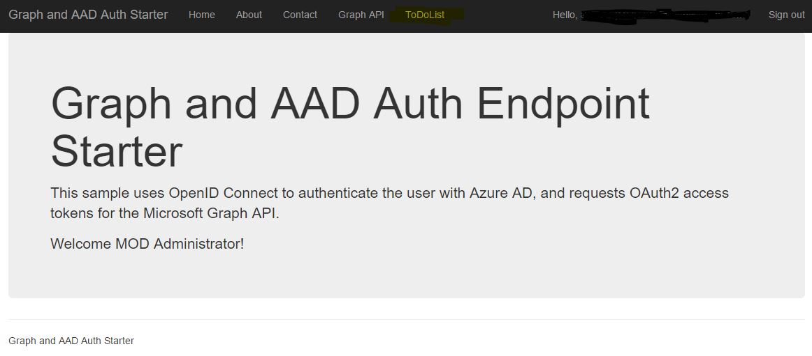

The app uploads `ToDoList.xlsx` and displays task listing page. Since there are no tasks added yet, you will see blank listing.  


Click on the `Add new` link to create a new task. Add few tasks with various stages of status. 
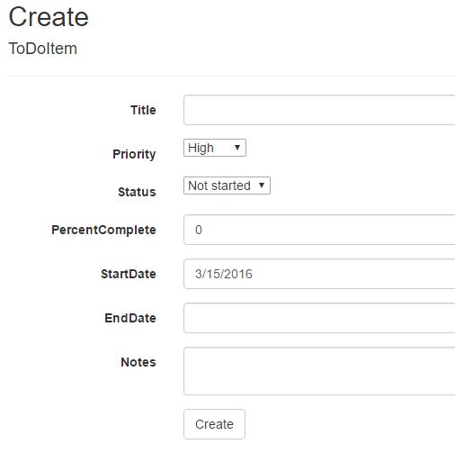

After adding each task, the app shows the updated task listing. If the newly added task is not updated, click the `Refresh` link after few moments. 

A sample list tasks are shown below.  
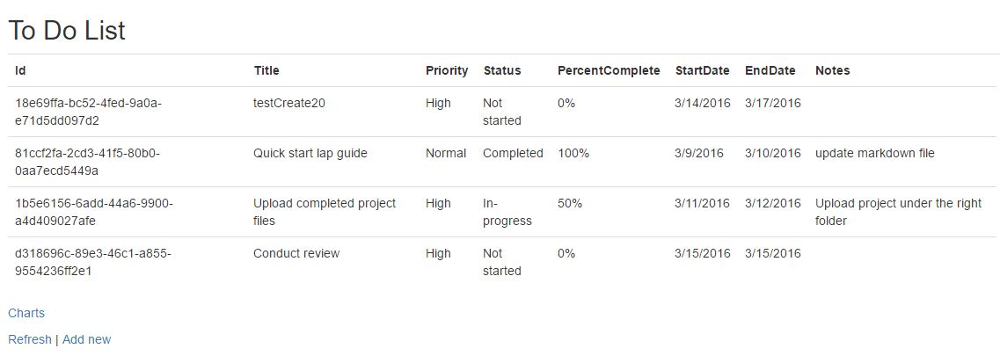

Click on the `Charts' link to see the breakdown of tasks using a pie chart created and downloaded (as image) using the Excel API.
 


#### View source Excel file

As a last step, you can login to the OneDrive Business account and open the `ToDoList.xlsx` in the browser to see the updates made by the app. **Do not open the file using the Excel desktop application as it will result in edit conflict for future updates made using the app**. 


## Overview of Excel API

### Usage scenario

* User maintains or stores Excel files in OneDrive Business. 
* User authorizes a web/mobile application to read/update OneDrive file contents.
* App can access the Excel file contents and make updates over the OneDrive files REST API available through Microsoft Graph. 
* A `/workbook` segment is added in the URL at the end of file identifier to distinguish the Excel API call and access workbook's data model. Example: 
https://graph.microsoft.com/v1.0/me/files/{id}/workbook/worksheets/Sheet1/tables
* Using Excel REST API, App reads or updates the Excel file content as necessary. Any updates made to the file is saved to the document on OneDrive. 

Note: 

* A workbook corresponds to one Excel document. Only one document can be addressed at a time. 
* The Excel API doesn’t allow user to create or delete the document itself. For those functionalities, regular OneDrive files API can be used. 


### Platform support

Currently, the Excel REST APIs are supported on any Excel workbook stored on your OneDrive Business document library or Group's document library. 

### Excel REST object model

There are several resources available as part of Excel API. Below list shows some of the top level important objects.

* Workbook: Workbook is the top level object which contains related workbook objects such as worksheets, tables, named items, etc.
* Worksheet: The Worksheet object is a member of the Worksheets collection. The Worksheets collection contains all the Worksheet objects in a workbook.
* Range: Range represents a cell, a row, a column, a selection of cells containing one or more contiguous blocks of cells.  
* Table: Represents collection of organized cells designed to make management of the data easy. 
    * TableColumn: Represents a column in the table
    * TableRow: Represents a row in the table. 
* Chart: Represents a chart object in a workbook, which is a visual representation of underlying data.  
* NamedItem: Represents a defined name for a range of cells or a value. Names can be primitive named objects (as seen in the type below), range object, etc.
* Application: Represents the Excel application that manages the workbook. Get the calculation mode of the workbook and perform calculation.
* Create Session: Create Excel workbook sessions. It is a good practice to create workbook session and pass it along with the request as part of the request header as it allows the server to link the API request to an existing in-memory copy of the file on the server. If a session ID is not provided, the server dynamically creates a session behind the scene. However, this requires additional server side processing and could add to the latency of the response. Session ID has a life span which gets extended with each usage or regresh. Once a session ID has expired, a new session session ID needs to be created. If an expired or invalid session token is provided as part of the request, the API will return an error indicating that the session ID is not valid.        

